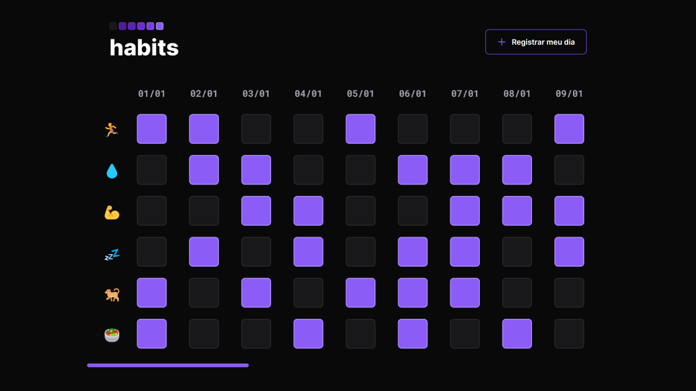

<h1 align="center">
  
    
</h1>

  <a href="https://lp.rocketseat.com.br/nlw">NLW Setup</a> - Explorer A project by <a href="https://www.rocketseat.com.br/">Rocketseat</a>

<h3 align="center">
  Habits 🗓️
</h3>

  

<h2>📋 The challenge</h2>

The project was to build a daily <a href="https://www.figma.com/community/file/1195050984449538256">habit tracker</a> assistant.

- Made some changes of my own and added some hover animations and a button to display a complete mockup of the application.

 

<h3>🧪 Built with</h3>

- HTML
- CSS
- JavaScript

<h3>🔗 Links</h3>

- Live Site URL: [https://phislipe.github.io/nlw-setup/](https://phislipe.github.io/nlw-setup/)

---

  Made by <a href="https://phislipe.dev"><b>Philipe Rocha</b></a>

